# Setting Up My Static Website Using Nginx

## Introduction

For my first project in the bootcamp, I embarked on setting up a static website using Nginx, hosted on an AWS EC2 instance. The process also involved configuring a custom domain with Amazon Route 53 and securing the website with SSL/TLS certificates using Certbot. Below is a step-by-step walkthrough of how I accomplished this task, along with some insights I gathered along the way.

---

## Step 1: Registering a Domain Name

The first task was to acquire a domain name. I chose to purchase mine from [Namecheap](https://www.namecheap.com/). After browsing through a few options, I settled on a domain that suited my project.

- **Task:** Purchase a domain name.
- **Result:** Domain purchased successfully.

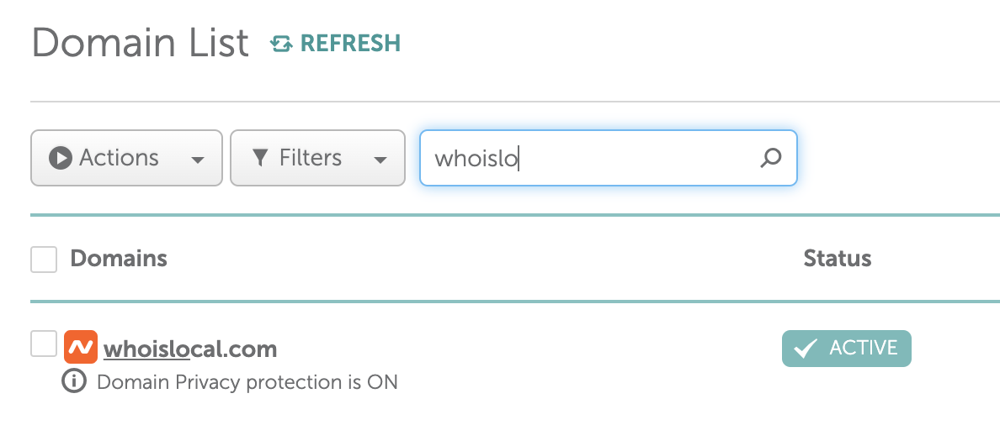

---

## Step 2: Launching an Ubuntu Server on AWS EC2

With my domain secured, the next step was to launch an Ubuntu server on AWS EC2.

1. I logged into the AWS Management Console and navigated to the **EC2** service.
2. I clicked on **Launch Instance** and selected the **Ubuntu** AMI as the base image for my server.
3. I configured the instance details, ensuring I selected the correct instance type (t2.micro to stay within the free tier) and created a new key pair for SSH access.

- **Task:** Launch an Ubuntu server on AWS EC2.
- **Result:** EC2 instance launched and running.

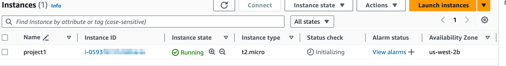
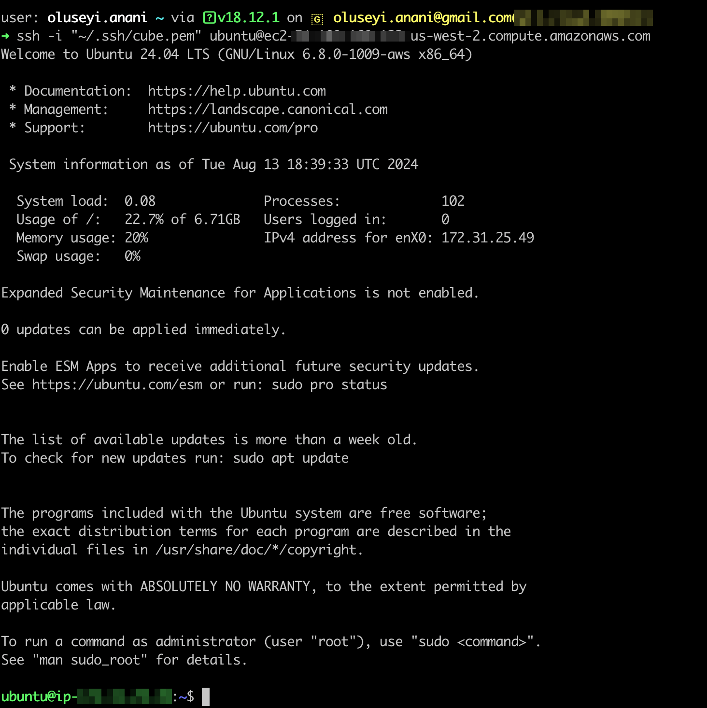

---

## Step 3: Assigning an Elastic IP to My Instance

To make my server accessible over the internet, I needed a static IP address. I did this by assigning an Elastic IP to my EC2 instance.

1. I navigated to the **Elastic IPs** section under **Network & Security**.
2. I allocated a new Elastic IP address and associated it with my running instance.

- **Task:** Assign an Elastic IP to the instance.
- **Result:** Elastic IP assigned successfully.

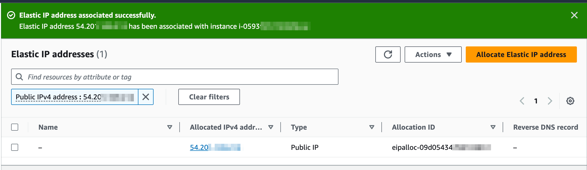

---

## Step 4: Connecting to the Server via SSH

With my server up and running, I used the key pair I generated earlier to connect to my server via SSH. Here’s how I did it:

1. I copied the SSH command provided by AWS.
2. Opened the terminal on my computer, from my home directory, I pointed to where my `.pem` file was saved (`~/.ssh/cube`), and pasted the SSH command making sure to properly access my `.pem` file.

- **Task:** Connect to the EC2 instance via SSH.
- **Result:** Successfully connected to the server.


---

## Step 5: Installing Nginx on the Server

Next, it was time to install Nginx, the web server that would serve my static website.

1. After logging into my server, I ran the following commands to update my package list and install Nginx:

```bash
sudo apt update && sudo apt install nginx
```

2. I then started the Nginx service and made sure it would automatically start on boot.

```bash
sudo systemctl start nginx && sudo systemctl enable nginx

```

- **Task:** Install and start Nginx.
- **Result:** Nginx installed and running.

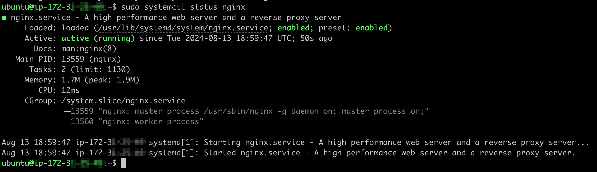
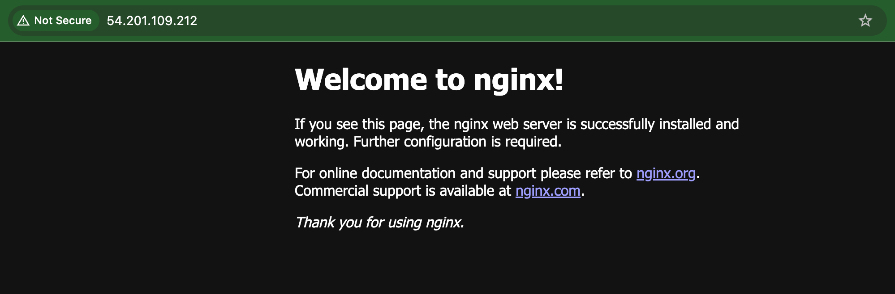

## Step 6: Uploading My Website Files

For the website itself, I opted to use a free HTML template. I downloaded the template directly onto my server using `curl`.

1. I navigated to the template provider's website (I choose Tooplate).
2. I copied the download URL of the template and used the `curl` command to download the template directly into the Nginx web directory.

```bash
   sudo curl -O https://www.tooplate.com/zip-templates/2088_big_city.zip
```
3. After downloading, I unzipped the template in the appropriate directory (`/var/www/html`).

```bash
sudo apt install unzip && sudo unzip 2088_big_city.zip
```

- **Task**: Download and unzip website files.
- **Result**: Website files uploaded and extracted.

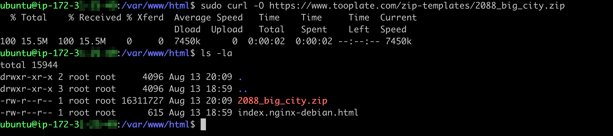
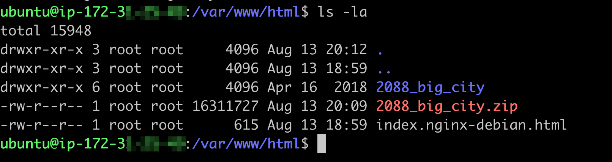

## Step 7: Configuring Nginx to Serve My Website

With the website files in place, I needed to update the Nginx configuration to point to the correct directory.

1. I edited the default Nginx configuration file using `vim`.

```bash
   sudo vim /etc/nginx/sites-available/default
```

2. I modified the root directive to point to the directory where my website files were located.

3. Finally, I restarted Nginx to apply the changes.

```bash
sudo systemctl restart nginx
```

- **Task:** Configure Nginx to serve the website.
- **Result:** Nginx successfully configured to serve my static website.

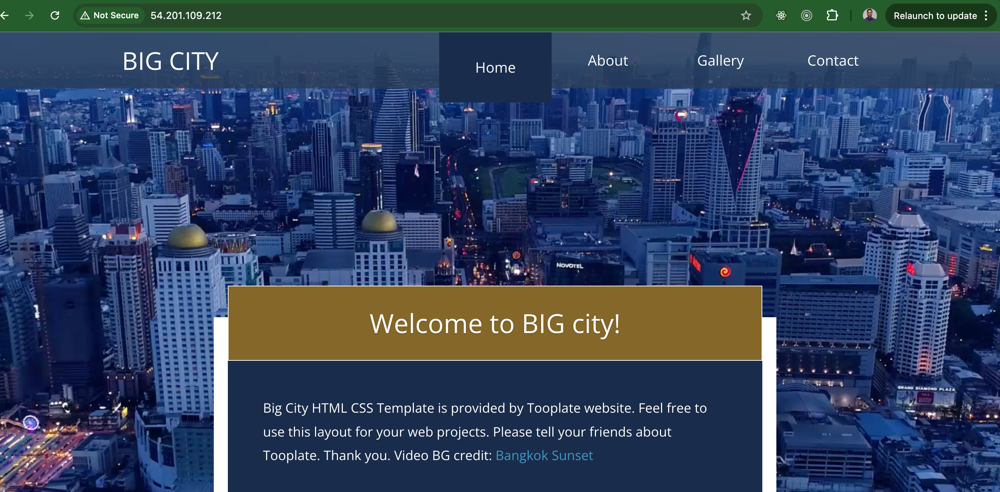


## Step 8: Setting Up DNS with Route 53

Now it was time to make my website accessible via my custom domain. I set up DNS using Amazon Route 53.

1. I created a new hosted zone in Route 53 for my domain.
2. I added an A record pointing to the Elastic IP of my server.
3. I also updated the DNS settings with my domain registrar (Namecheap) to use the Route 53 nameservers.

- **Task:** Configure DNS with Route 53.
- **Result:** Domain successfully pointing to my server.

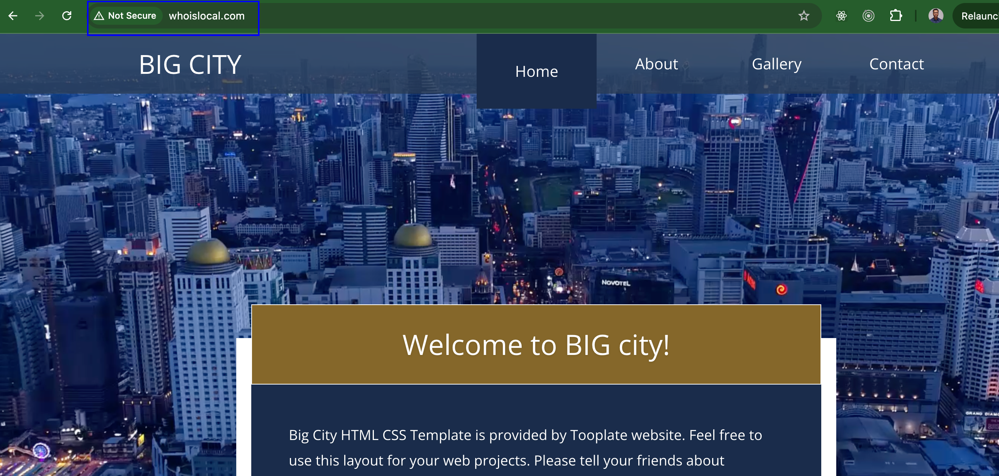

---

## Step 9: Installing Certbot and Securing the Website with SSL/TLS

To ensure my website was secure, I used Certbot to obtain an SSL certificate from Let’s Encrypt.

1. I installed Certbot and the Nginx plugin.

```bash
   sudo apt update && sudo apt install certbot python3-certbot-nginx
```
2. I ran Certbot to obtain the certificate and automatically configure Nginx.

```bash
sudo certbot --nginx
```
3. After completing the process, I verified the SSL certificate using OpenSSL.

```bash
openssl s_client -connect whoislocal.com:443
```

- **Task:** Install Certbot and obtain SSL/TLS certificate.
- **Result:** Website secured with SSL/TLS.

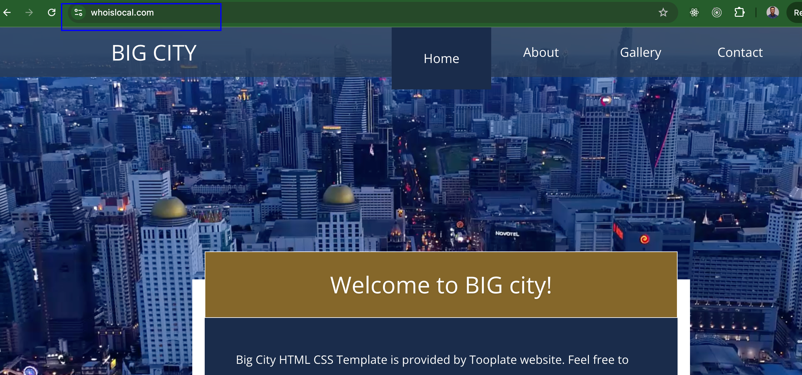

## Conclusion

Setting up this static website was a valuable learning experience, helping me get hands-on with Nginx, AWS, and Certbot. By following these steps, I now have a live, secure website that I can build upon in future projects. It’s rewarding to see everything come together, from registering a domain to securing it with HTTPS.

---

*End of Project 1 Documentation.*
