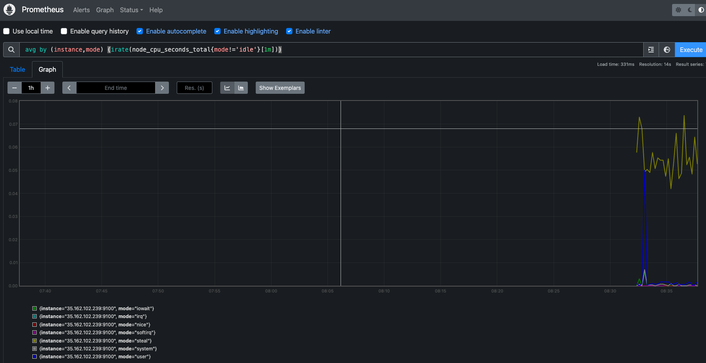
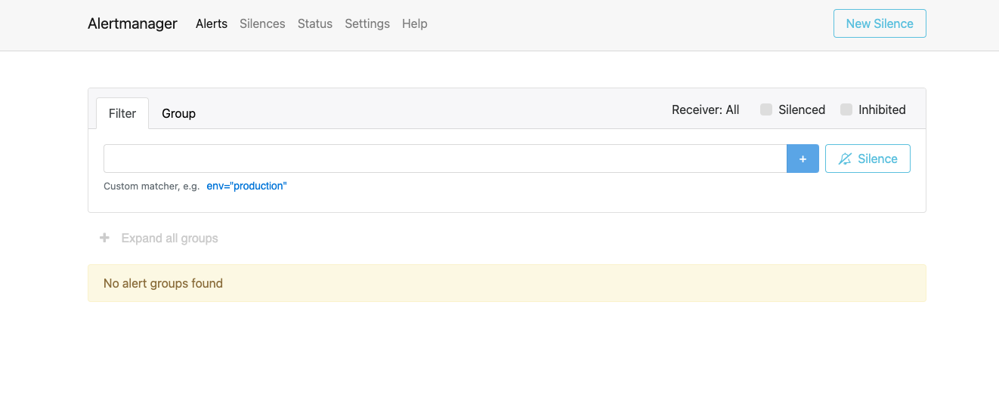
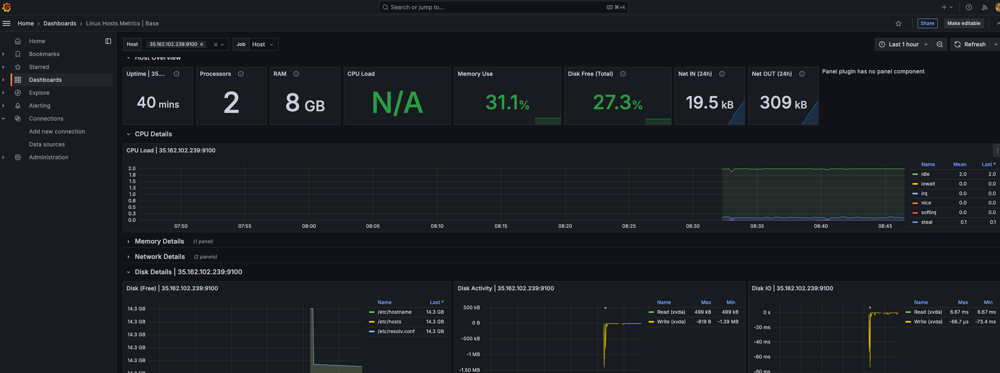
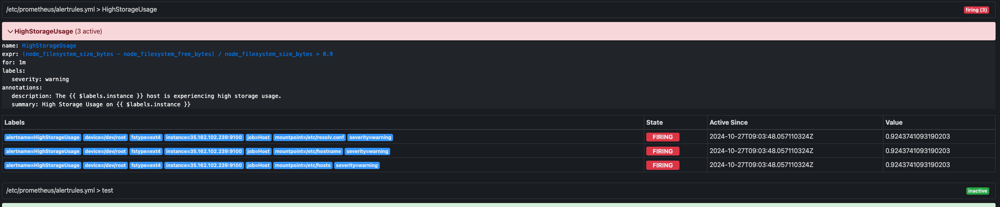

# Project 10: Deploying a Prometheus Stack with Docker Compose on AWS

## Introduction

In this project, I deployed a **Prometheus stack** using Docker Compose on an AWS EC2 instance, a solution for comprehensive monitoring and alerting. The project was centered on setting up Prometheus, Alert Manager, Node Exporter, and Grafana, all orchestrated through Docker Compose for efficiency. Using Terraform, I automated the provisioning of the necessary infrastructure, allowing for repeatable, consistent deployments and smooth scaling of services.

## Key Components

- **Prometheus**: Open-source monitoring system designed to collect and store time-series data.
- **Alert Manager**: Manages alerts generated by Prometheus and sends them to specified channels.
- **Node Exporter**: Collects system-level metrics to provide insight into server performance.
- **Grafana**: Data visualization tool that connects to Prometheus for real-time monitoring.
- **Terraform**: Infrastructure as Code (IaC) tool for automating AWS resources provisioning.
- **Docker & Docker Compose**: Platforms to build, ship, and manage containers for isolated, consistent environments.

---

## Step 1: Setting Up AWS Infrastructure

I began by creating an **Ubuntu 24.04** EC2 instance in AWS to host the monitoring stack. Here’s a summary of the preliminary requirements:

1. **AWS CLI** and **Terraform** installed locally.
2. AWS IAM role with `AmazonVPCFullAccess` and `AmazonEC2FullAccess` policies.

### Provisioning the Instance Using Terraform

To simplify infrastructure provisioning, I used Terraform. The project is structured to include:

- **Terraform Modules**: Reusable Terraform files (`main.tf`, `outputs.tf`, `variables.tf`).
- **ec2.tfvars**: Stores variables such as `region`, `instance_type`, and `subnet_ids`.

Here’s a quick look at the `ec2.tfvars` file setup:

```hcl
region = "us-west-2"
ami_id = "ami-0aff18ec83b712f05"
instance_type = "t2.large"
key_name = "cube"
```

Next, I ran the Terraform commands to deploy the instance:

```
terraform init
terraform plan --var-file=../vars/ec2.tfvars
terraform apply --var-file=../vars/ec2.tfvars
```
After confirming, Terraform created the EC2 instance and necessary security groups. I then SSH’d into the new instance to begin setup.

### Step 2: Preparing the EC2 Instance for Docker and Docker Compose

After connecting to the instance, I installed Docker and Docker Compose:

```bash
sudo apt update
sudo apt install docker.io -y
sudo apt install docker-compose -y
```

### Checking Installation
To confirm, I checked Docker and Docker Compose versions:

```bash
docker --version
docker-compose --version
```

## Step 3: Cloning the Prometheus Project Repository
With Docker set up, I cloned the Prometheus stack project repository:

```bash
git clone https://github.com/TobiOlajumoke/prometheus-observability-stack
cd prometheus-observability-stack
```
The repository is organized to include configuration files for Prometheus, Alert Manager, and Node Exporter, as well as Docker Compose.

## Step 4: Deploying the Prometheus Stack with Docker Compose
### Updating Configurations
To ensure the stack components can communicate, I updated the public IP of the EC2 instance in `prometheus.yml` and `targets.json` by running:

```bash
make all
```

### Running the Stack
I used Docker Compose to bring up the services:
```bash
sudo docker-compose up -d
```
Docker Compose then orchestrated the deployment of Prometheus, Grafana, Node Exporter, and Alert Manager, each configured to run on its respective port.

## Step 5: Accessing and Validating the Prometheus Stack
With the stack running, I accessed the components via the public IP address on the following ports:

1. Prometheus: http://35.162.102.239:9090
2. Alert Manager: http://35.162.102.239:9093
3. Grafana: http://35.162.102.239:3000





### Validating Node Exporter Metrics
Using Prometheus’ UI, I checked metrics by querying:
```bash
avg by (instance,mode) (irate(node_cpu_seconds_total{mode!='idle'}[1m]))
```
The query displayed node-level CPU metrics in the Prometheus dashboard.

## Step 6: Configuring Grafana Dashboards
1. Accessing Grafana: I logged in with the default credentials (admin/admin) and changed the password.
2. Adding Prometheus as a Data Source: Connected to Prometheus by navigating to Connections > Add new connection > Prometheus.
3. Importing Node Exporter Dashboard: Using Grafana’s pre-built dashboard ID 10180 to visualize key metrics.

## Step 7: Testing Alerts with Alert Manager
Alert rules configured in `alertrules.yml` triggered alerts based on CPU and storage metrics. I simulated a high CPU load using:
```bash
dd if=/dev/zero of=testfile_16GB bs=1M count=16384; openssl speed -multi $(nproc --all) &
```



### Checking Alerts
Alerts appeared in both Prometheus and Alert Manager as expected. I later rolled back the test to verify the alert was resolved:
```bash
rm testfile_16GB && kill $(pgrep openssl)
```

## Step 8: Cleanup
Once validated, I cleaned up the environment using Terraform:
```bash
terraform destroy --var-file=../vars/ec2.tfvars
```
After confirming with `yes`, all resources were deleted.

## Conclusion
This project allowed me to implement a full monitoring stack using Prometheus, Grafana, Node Exporter, and Alert Manager on AWS with Docker Compose and Terraform. I deepened my understanding of monitoring, alerting, and data visualization for infrastructure, along with the benefits of using IaC for provisioning cloud resources. This setup provides a solid foundation for monitoring and managing cloud infrastructure in real-time.
