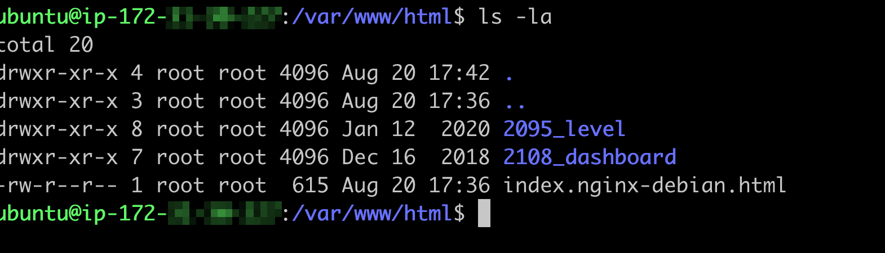

# Hosting Multiple Static Websites on a Single Server Using Nginx Virtual Hosts

## Introduction

For my second project in the bootcamp, I explored the concept of hosting multiple static websites on a single server using Nginx Virtual Hosts. The project involved configuring two subdomains and setting up SSL certificates to secure the websites.
Below is a detailed walkthrough of how I completed each step of the project, along with the insights I gained.

## Step 1: Installing and Configuring Nginx on the Server

The first task was to install and configure Nginx on my Ubuntu server. Here’s how I did it:

1. I connected to my AWS EC2 instance via SSH.
2. I updated the package list and installed Nginx using the following commands:

    ```bash
    sudo apt update
    sudo apt upgrade
    sudo apt install nginx
    ```

3. I started the Nginx service and enabled it to start on boot:

    ```bash
    sudo systemctl start nginx
    sudo systemctl enable nginx
    ```

4. To confirm that Nginx was running, I checked its status:

    ```bash
    sudo systemctl status nginx
    ```

- **Task:** Install and configure Nginx on the server.
- **Result:** Nginx installed and running successfully.


## Step 2: Creating Two Website Directories with Different Templates

Next, I created two directories on the server, each for a different website. I used free HTML templates for the content.

1. I navigated to the `/var/www/html` directory where the website files would be stored.

2. I downloaded the first template using `curl` and unzipped it into a directory named `level`:

    ```bash
    sudo curl -o /var/www/html/2095_level.zip https://www.tooplate.com/zip-templates/2095_level.zip && sudo unzip -d /var/www/html/ /var/www/html/2095_level.zip && sudo rm -f /var/www/html/2095_level.zip
    ```

3. I repeated the process for the second template, storing it in a directory named `dashboard`:

    ```bash
    sudo curl -o /var/www/html/2108_dashboard.zip https://www.tooplate.com/zip-templates/2108_dashboard.zip && sudo unzip -d /var/www/html/ /var/www/html/2108_dashboard.zip && sudo rm -f /var/www/html/2108_dashboard.zip
    ```

- **Task:** Create two website directories with different templates.
- **Result:** Website files successfully downloaded and organized into directories.



## Step 3: Creating and Configuring Subdomains

To host the two websites under different subdomains, I first created two subdomains and then set up A records in Route 53.

1. In Amazon Route 53, I created a hosted zone for my root domain.
2. I added an A record for each subdomain (`level.whoislocal.com`, `www.level.whoislocal.com`, `www.dashboard.whoislocal.com` and `dashboard.whoislocal.com`) pointing to the Elastic IP of my server.

- **Task:** Create two subdomains and configure A records.
- **Result:** Subdomains created and pointing to the server.

## Step 4: Configuring Nginx Virtual Hosts

With the subdomains in place, I configured Nginx to serve different content based on the subdomain.

1. I created a new configuration file for the cleaning website:

    ```bash
    sudo nano /etc/nginx/sites-available/cleaning
    ```

2. I added the following configuration:

    ```bash
    server {
        listen 80;
        server_name cleaning.mywebsite.com www.cleaning.mywebsite.com;

        root /var/www/html/cleaning;
        index index.html;

        location / {
            try_files $uri $uri/ =404;
        }
    }
    ```

3. I repeated the process for the health website:

    ```bash
    sudo nano /etc/nginx/sites-available/health
    ```

   And added this configuration:

    ```bash
    server {
        listen 80;
        server_name health.mywebsite.com www.health.mywebsite.com;

        root /var/www/html/health;
        index index.html;

        location / {
            try_files $uri $uri/ =404;
        }
    }
    ```

4. To enable these sites, I created symbolic links in the `sites-enabled` directory:

    ```bash
    sudo ln -s /etc/nginx/sites-available/level /etc/nginx/sites-enabled/
    sudo ln -s /etc/nginx/sites-available/dashboard /etc/nginx/sites-enabled/
    ```

5. I tested the configuration and restarted Nginx:

    ```bash
    sudo nginx -t
    sudo systemctl restart nginx
    ```

- **Task:** Configure Nginx Virtual Hosts for subdomains.
- **Result:** Virtual hosts configured, and subdomains correctly routed to their respective websites.


## Step 5: Securing the Websites with SSL/TLS Using Certbot

To secure the websites, I used Certbot to obtain SSL certificates for both subdomains.

1. I installed Certbot and the Nginx plugin:

    ```bash
    sudo apt install python3-certbot-nginx
    ```

2. I ran Certbot to obtain certificates for both subdomains:

    ```bash
    sudo certbot --nginx
    ```

   I followed the prompts to select the subdomains and automatically configure Nginx to use the SSL certificates.

3. Finally, I verified the SSL configuration using the OpenSSL utility:

    ```bash
    openssl s_client -connect level.mywebsite.com:443
    openssl s_client -connect dashboard.mywebsite.com:443
    ```

- **Task:** Install Certbot and configure SSL for the websites.
- **Result:** SSL/TLS certificates obtained and websites secured with HTTPS.


## Conclusion

This project was a deep dive into Nginx Virtual Hosts and SSL/TLS configuration. By following these steps, I successfully hosted two static websites on a single server, each accessible via its own subdomain and secured with HTTPS. This experience enhanced my understanding of web server management, DNS configuration, and web security.

**End of Project 2 Documentation.**
