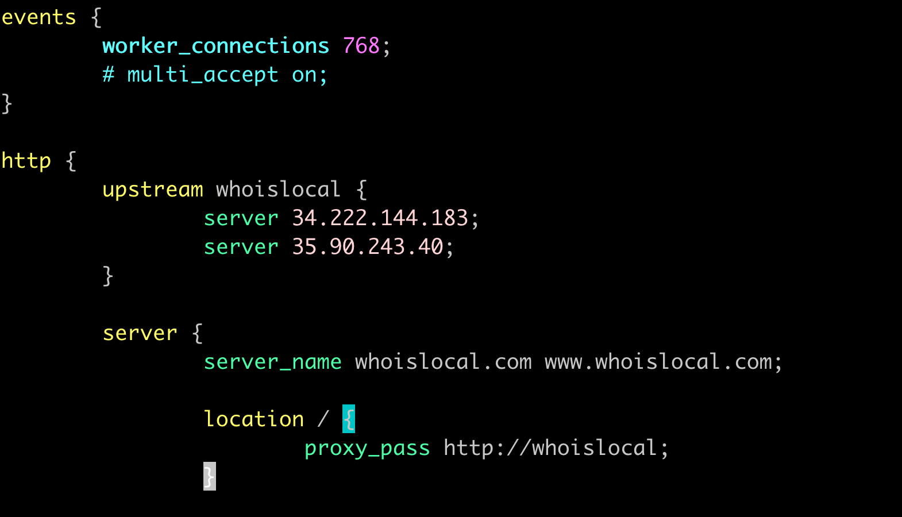

# Project 3: Setup Load Balancing for Static Websites Using Nginx

## Introduction

For the third project in my bootcamp series, I dove into setting up load balancing for static websites using Nginx. This project involved configuring Nginx as a load balancer to distribute traffic across multiple servers, enhancing reliability and availability.

## Type of Load Balancer

I used Nginx as a reverse proxy load balancer, which helps distribute incoming client requests evenly across multiple servers.

## Characteristics

- **HTTP Load Balancing:** Utilizes HTTP protocol for balancing.
- **Round Robin Scheduling:** Default scheduling method, distributing requests sequentially among available servers.
- **Scalability:** Easy inclusion of additional servers in the upstream block for scaling purposes.

## Step 1: Deploying Three Servers

The initial step involved setting up three separate servers:

1. Two servers hosted static websites.
2. The third server was configured as the load balancer.

- **Task:** Deploy and set up three Ubuntu servers.
- **Result:** Servers deployed successfully.


## Step 2: Setting Up Static Websites

I set up static websites on the first two servers using Nginx:

1. I installed Nginx and configured each server to host distinct HTML content, ensuring they could be differentiated when accessed.

    ```bash
    sudo apt update
    sudo apt install nginx
    sudo systemctl start nginx
    ```

2. For each server, I used different HTML templates to clearly distinguish between the two during load balancing tests.

- **Task:** Install Nginx and deploy static websites.
- **Result:** Websites set up and operational on two servers.


## Step 3: Configuring Nginx as a Load Balancer

I configured the third server to act as a load balancer:

1. I installed Nginx and set up the load balancing configuration to distribute requests between the two website servers using a round-robin method.

    ```bash
    sudo vim /etc/nginx/nginx.conf
    ```

   Added the following block in http part:

    ```nginx
     upstream whoislocal {
                server 34.222.144.183;
                server 35.90.243.40;
        }

        server {
                server_name whoislocal.com www.whoislocal.com;

                location / {
                        proxy_pass http://whoislocal;
            }
      }
    ```

2. I tested and restarted Nginx to apply the new configuration.

    ```bash
    sudo nginx -t
    sudo systemctl restart nginx
    ```

- **Task:** Configure and start Nginx load balancer.
- **Result:** Load balancer configured and directing traffic between two servers.



## Step 4: DNS Configuration and Validation

I added an A record for the load balancer in DNS to allow public access:

1. In Route 53, I pointed my domain to the IP of the Nginx load balancer server.

2. I tested the load balancing by accessing the domain and observed the requests being alternately served by the two backend servers.

- **Task:** Update DNS to point to the load balancer and validate traffic distribution.
- **Result:** Load balancing operational and verified by alternating responses from the servers.


## Step 5: Securing the Websites with SSL/TLS

To secure the traffic between the client and the load balancer, I installed SSL certificates:

1. I ran Certbot on the load balancer server to obtain and configure SSL certificates for the domain.

    ```bash
    sudo certbot --nginx -d whoislocal.com -d www.whoislocal.com
    ```

2. I confirmed the security by accessing the websites via HTTPS and using OpenSSL to inspect the SSL certificate.

    ```bash
    openssl s_client -connect whoislocal.com:443
    ```

- **Task:** Install SSL certificates using Certbot.
- **Result:** HTTPS successfully enabled and verified.


## Conclusion

Setting up a load balancer using Nginx was an enriching experience and looking forward to applying this experiences to solving real world problems.

---

*End of Project 3 Documentation.*
