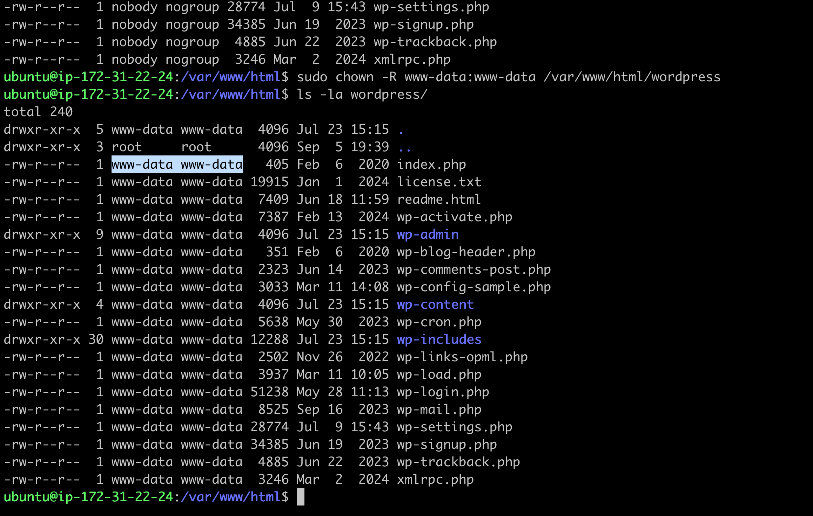

# Project 4: Setup WordPress Website Using LAMP Stack

## Introduction

In my fourth project, I proceeded on setting up a WordPress website using the LAMP stack.
This setup provided me with a foundation to deploy a WordPress platform.

## Components Used

- **Linux:** As the operating system, Linux provided a stable and secure environment for running the other components.
- **Apache:** Served as the web server, handling requests and delivering web content.
- **MySQL:** Acted as the database, storing all WordPress data including content, user information, and settings.
- **PHP:** As the scripting language driving the WordPress engine.

## Step 1: Deploying an Ubuntu Server

The first step was to set up an Ubuntu server on AWS EC2 for the LAMP stack.

- **Task:** Deploy an Ubuntu server on AWS EC2.
- **Result:** Server successfully deployed.


## Step 2: Installing the LAMP Stack

Next, I installed the LAMP components on the server:

1. **Apache Installation:**
    ```bash
    sudo apt update
    sudo apt install apache2
    sudo systemctl start apache2
    ```
2. **MySQL Installation:**
    ```bash
    sudo apt install mysql-server
    sudo mysql_secure_installation
    ```
3. **PHP Installation:**
    ```bash
    sudo apt install php libapache2-mod-php php-mysql
    ```

- **Task:** Install and configure Apache, MySQL, and PHP.
- **Result:** LAMP stack installed and configured successfully.


## Step 3: Configuring WordPress

I then proceeded to configure WordPress on the LAMP stack:

1. **WordPress Download and Setup:**
    ```bash
    cd /var/www/html
    sudo wget http://wordpress.org/latest.tar.gz
    sudo tar -xvzf latest.tar.gz
    ```
2. **Database Configuration for WordPress:**
    ```bash
    sudo mysql -u root -p
    CREATE DATABASE wp_db;
    GRANT ALL PRIVILEGES ON wordpress_db.* TO 'oluseyi'@'localhost' IDENTIFIED BY 'password';
    FLUSH PRIVILEGES;
    ```

- **Task:** Configure WordPress with a dedicated MySQL database.
- **Result:** WordPress configured and database set.



## Step 4: DNS Configuration and Mapping

For public accessibility, I mapped the IP address to the DNS A record:

1. **Route 53 Setup:**
   Adding an A record for the server’s IP to link the domain to the WordPress site.

- **Task:** Update DNS settings to point to the new WordPress site.
- **Result:** Domain successfully pointed to the WordPress server.


## Step 5: Securing the Website with SSL/TLS

To enhance security, I installed SSL certificates using Certbot:

```bash
sudo apt-get install certbot python3-certbot-apache
sudo certbot --apache -d whoislocal.com -d www.whoislocal.com
```

- **Task:** Secure WordPress site with SSL/TLS certificates.
- **Result:** SSL/TLS certificates installed and site secured with HTTPS.

## Conclusion

Completing this project gave me an understanding of deploying WordPress with a LAMP stack and also gave me an understanding of what's possible in terms of setting up various tech stacks
