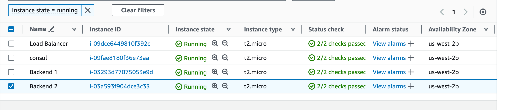
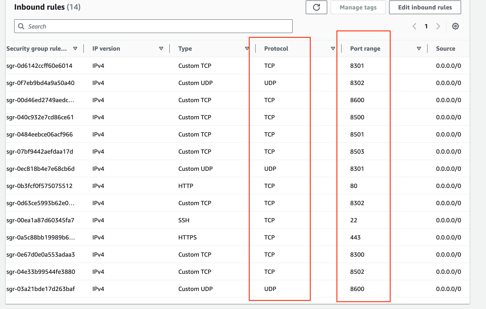

# Project 5: Setup Service Discovery Using Nginx & Consul

## Introduction

In my fifth project, I delved into setting up service discovery using **Nginx** and **Consul**. Service discovery is essential in modern microservices architectures, where services need to find and communicate with each other dynamically. This project involved configuring Consul for service registration and discovery, setting up Nginx as a load balancer, and validating the dynamic updating of backend services.

## Key Concepts

- **Service Discovery:** Automating how services locate and communicate with each other on a network.
- **Consul:** An open-source tool by HashiCorp for service discovery and configuration.
- **Nginx:** Used as a reverse proxy and load balancer to distribute traffic among backend servers.
- **Dynamic Scaling:** Allowing services to scale up or down without manual reconfiguration.

## Step 1: Deploying Four Ubuntu Servers

I began by deploying four Ubuntu servers on AWS EC2:

1. **Consul Server:** Acts as the central service registry.
2. **Load Balancer Server:** Runs Nginx to distribute incoming traffic.
3. **Backend Server 1:** Hosts a static website.
4. **Backend Server 2:** Hosts another static website.

- **Task:** Deploy and set up four Ubuntu servers.
- **Result:** Servers deployed and renamed for easy identification.



## Step 2: Configuring Security Groups

I configured the security group to allow necessary ports for Consul and Nginx:

- Opened ports for Consul communication (TCP and UDP on ports 8300-8302, 8500-8503, and 8600).
- Allowed HTTP (port 80) and SSH (port 22) traffic.

- **Task:** Configure security group with required ports.
- **Result:** Security group updated with necessary inbound rules.



## Step 3: Setting Up the Consul Server

I installed and configured Consul on the Consul server with the following steps:

1. **Install Consul:**

```bash
wget -O- https://apt.releases.hashicorp.com/gpg | \
 gpg --dearmor | \
 sudo tee /usr/share/keyrings/hashicorp-archive-keyring.gpg

echo "deb [signed-by=/usr/share/keyrings/hashicorp-archive-keyring.gpg] \
 https://apt.releases.hashicorp.com $(lsb_release -cs) main" | \
 sudo tee /etc/apt/sources.list.d/hashicorp.list

sudo apt update
sudo apt install consul
```
   
2. **Verify Installation:**

```bash
consul --version
```
   
3. **Configure Consul:**
   - Generate an encryption key:
   ```bash
   consul keygen
   ```
   - Backup the default configuration:
   ```bash
   sudo mv /etc/consul.d/consul.hcl /etc/consul.d/consul.hcl.back
   ```
   - Create a new configuration file:
   ```bash
   sudo vi /etc/consul.d/consul.hcl
   ```
   Added the following content to the file
   ```text
    bind_addr = "0.0.0.0"
    client_addr = "0.0.0.0"
    data_dir = "/var/consul"
    encrypt = "<ENCRYPTED_KEY_GENERATED_FROM_PREVIOUS_STEP>"
    datacenter = "dc1"
    ui = true
    server = true
    log_level = "INFO"
   ```
4. **Start Consul Server:**

```bash
sudo nohup consul agent -dev -config-dir /etc/consul.d/ &
```
5. **Verify Consul Server Status:**
```bash
consul members 
```
- **Task:** Install and configure Consul server.
- **Result:** Consul server running and accessible via the web UI.

## Step 4: Setting Up Backend Servers

On both backend servers, I installed **Nginx** and **Consul agents**.

1. **Update Packages and Install Nginx:**

   ```bash
   sudo apt-get update -y
   sudo apt install nginx -y
   ```

2. **Customize Web Pages:**
   - Navigated to the HTML directory:
```bash

cd /var/www/html
```

Edited index.html to display server-specific content:

```bash

sudo vi index.html
```

- Added the following HTML content to both servers:

```html

<!DOCTYPE html> 
<html> 
<head> 
   <title>Whoislocal Backend Server 01</title> 
</head> 
<body> 
<h1>This is Backend SERVER-01</h1> 
</body> 
</html>
```

```html

<!DOCTYPE html> 
<html> 
<head> 
   <title>Whoislocal Backend Server 02</title> 
</head> 
<body> 
<h1>This is Backend SERVER-02</h1> 
</body> 
</html>
```
3. **Install Consul Agent:**

```bash
wget -O- https://apt.releases.hashicorp.com/gpg |
gpg --dearmor |
sudo tee /usr/share/keyrings/hashicorp-archive-keyring.gpg

echo "deb [signed-by=/usr/share/keyrings/hashicorp-archive-keyring.gpg]
https://apt.releases.hashicorp.com $(lsb_release -cs) main" |
sudo tee /etc/apt/sources.list.d/hashicorp.list

sudo apt update
sudo apt install consul
```
4. **Verify Installation:**

```bash
consul --version
```

5. **Configure Consul Agent:**

 - Backed-up the default configuration:

```bash
sudo mv /etc/consul.d/consul.hcl /etc/consul.d/consul.hcl.back
```

 - Created a new configuration file:

```bash
sudo vi /etc/consul.d/consul.hcl
```
Added the following content, replacing the encrypted key and consul server ip with the correct values:

```text
server = false
datacenter = "dc1"
data_dir = "/var/consul"
encrypt = "<YOUR_ENCRYPTED_KEY>"
log_level = "INFO"
enable_script_checks = true
enable_syslog = true
leave_on_terminate = true
start_join = ["<Consul_Server_IP>"]
```

 - Created the service registration file:

```bash
sudo vi /etc/consul.d/backend.hcl
```

 - Added the following content:

```text
service {
      name = "backend"
      port = 80
      check {
      args = ["curl", "localhost"]
      interval = "3s"
   }
}
```
6. **Validate Configuration:**

```bash
consul validate /etc/consul.d
```

7. **Start Consul Agent:**

```bash
sudo nohup consul agent -config-dir /etc/consul.d/ &
```

8. **Verify Registration:**

 - Check the Consul UI to ensure the backend services are registered.

- **Task:** Install Nginx and Consul agents on backend servers.
- **Result:** Backend servers registered with Consul and health checks configured.

## Step 5: Setting Up the Load Balancer
On the load balancer server, I configured Nginx and Consul Template.

1. **Install Nginx and Dependencies:**

```bash
sudo apt-get update -y
sudo apt-get install nginx unzip -y
```

2. **Install Consul Template:**

```bash
sudo curl -L https://releases.hashicorp.com/consul-template/0.30.0/consul-template_0.30.0_linux_amd64.zip -o /opt/consul-template.zip
sudo unzip /opt/consul-template.zip -d /usr/local/bin/
```

3. **Verify Installation:**

```bash
consul-template --version
```

4. **Configure Nginx with Consul Template:**

 - Create the Nginx template file:

```bash

sudo vi /etc/nginx/conf.d/load-balancer.conf.ctmpl
```

 - Add the following content:

```nginx
upstream backend {
   {{- range service "backend" }}
   server {{ .Address }}:{{ .Port }};
   {{- end }}
}

   server {
      listen 80;

   location / {
      proxy_pass http://backend;
   }
}
```

 - Create the Consul Template configuration file:

```bash
sudo vi /etc/nginx/conf.d/consul-template.hcl
```

Added the following content, replacing the encrypted key and consul server ip with the correct values:

```hcl
consul {
   address = "<Consul_Server_IP>:8500"

   retry {
      enabled = true
      attempts = 12
      backoff = "250ms"
   }
}
   template {
      source = "/etc/nginx/conf.d/load-balancer.conf.ctmpl"
      destination = "/etc/nginx/conf.d/load-balancer.conf"
      perms = 0600
      command = "service nginx reload"
}
```

5. **Remove Default Nginx Site:**

```bash
sudo rm /etc/nginx/sites-enabled/default
```
6. **Restart Nginx:**

```bash
sudo systemctl restart nginx
```
7. **Start Consul Template:**

```bash
sudo nohup consul-template -config=/etc/nginx/conf.d/consul-template.hcl &
```

8. **Verify Load Balancer Configuration:**

 - Check that `/etc/nginx/conf.d/load-balancer.conf` is populated with backend servers from Consul.

 - **Task:** Configure Nginx load balancer with dynamic backend using Consul.
 - **Result:** Load balancer operational and dynamically updating backend servers from Consul.


## Step 6: Validating Service Discovery Setup
To test the service discovery and health checks:

1. **Access the Load Balancer IP:**

 - Visit the load balancer's public IP in a web browser.
 - Confirm that it displays content from backend servers.
2. **Refresh the Page:**
- Observe that the content alternates between `SERVER-01` and `SERVER-02`, indicating load balancing.

3. **Stop One Backend Server:**

On one backend server, stop Nginx:

```bash
sudo systemctl stop nginx
```
 - Consul detects the service as unhealthy.

 - Load balancer stops sending traffic to the stopped backend.

4. **Verify in Consul UI:**

 - Check that the unhealthy service is marked accordingly.

 - **Task:** Validate dynamic service discovery and health checks.
 - **Result:** Service discovery functioning correctly; load balancer adjusts to backend changes in real-time.

## Conclusion
Completing this project enhanced my understanding of service discovery and dynamic scaling in distributed systems. By integrating Consul with Nginx, I was able to create a resilient infrastructure where services can be dynamically added or removed without manual reconfiguration. This setup demonstrates the power of automation in managing complex microservices architectures and ensures high availability and fault tolerance in real-world applications.

End of Project 5 Documentation.

