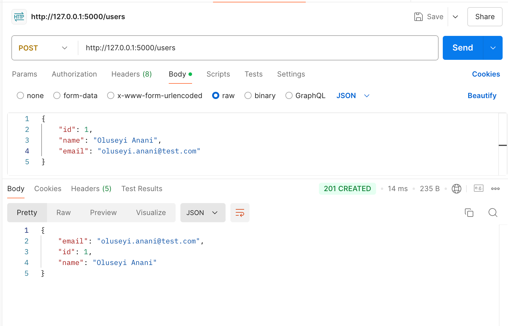
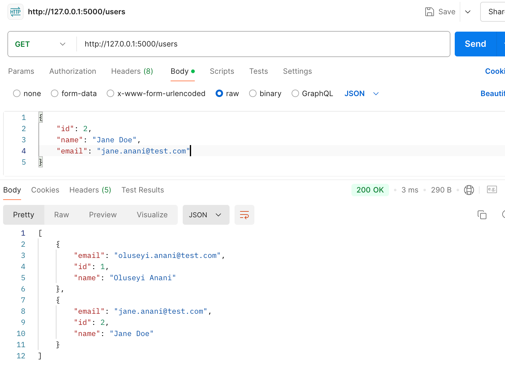
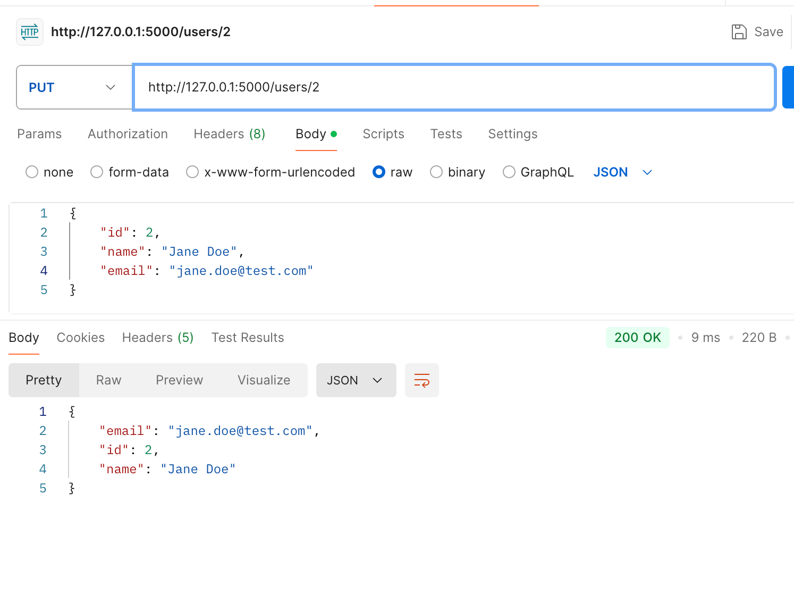
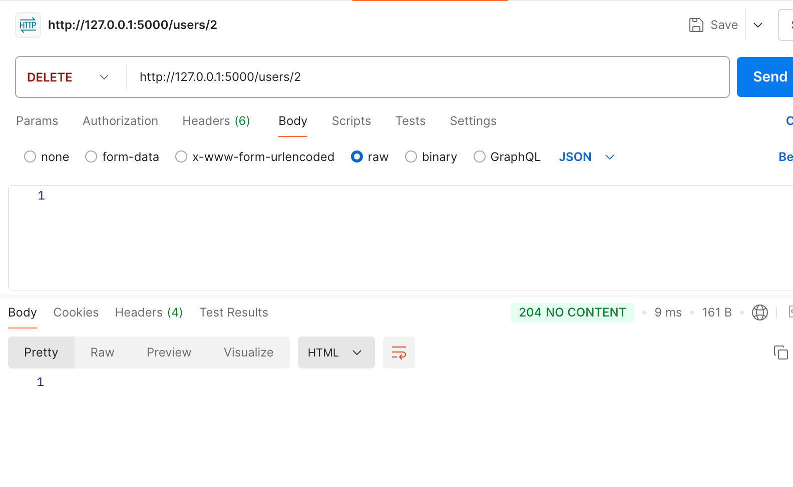
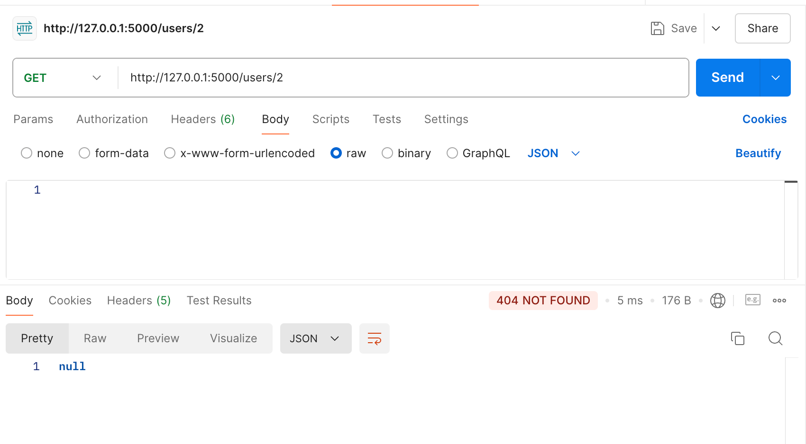

# Project 6: Flask API Project

## Description
In this project, I created a Flask-based API to manage user data. This API allows for basic CRUD operations—adding users, retrieving user lists, updating user information, and deleting users. The frontend interface is built using simple HTML and CSS, with JavaScript to handle form submissions. The API was tested using Postman to ensure correct functionality, and a virtual environment was set up to manage dependencies.

## Steps Covered

### Setting Up the Project Structure:
- Created the project directory structure, including folders for templates (HTML files) and static assets (CSS files).
- Set up a virtual environment for the project using Python's venv module.

[Code Link to Project 6](../code/project6)

**Startup Script:**
```bash
python -m venv flask_api_project/venv
```

### Building the Flask API:
- Implemented the Flask API with endpoints for handling CRUD operations:
    - `GET /users` to retrieve all users.
    - `POST /users` to add a new user.
    - `GET /users/<id>` to retrieve a specific user by ID.
    - `PUT /users/<id>` to update user information.
    - `DELETE /users/<id>` to delete a user.

### Frontend Development:
- Created a simple HTML form to add new users and display the list of users.
- Integrated JavaScript to handle form submissions and dynamically update the user list on the page.

### Testing the API:
- Used Postman to test the API endpoints and verify the correct implementation of HTTP methods (GET, POST, PUT, DELETE).







### Setting Up the Virtual Environment:
- Activated the virtual environment and installed Flask to manage the API and its dependencies.

### Deploying and Running the Application:
- Ran the Flask application locally and accessed it through the browser at `http://127.0.0.1:5000`.

### Testing with Postman:
- Created requests to test the API’s functionality, including creating, updating, and deleting users.
- Validated HTTP status codes for successful and unsuccessful API operations.
