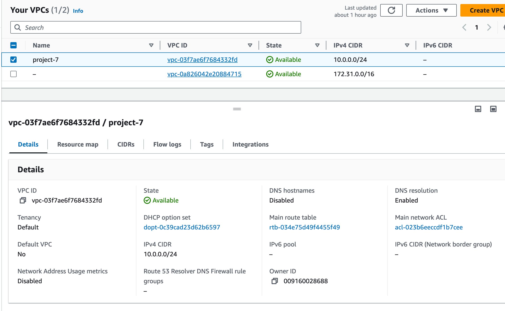
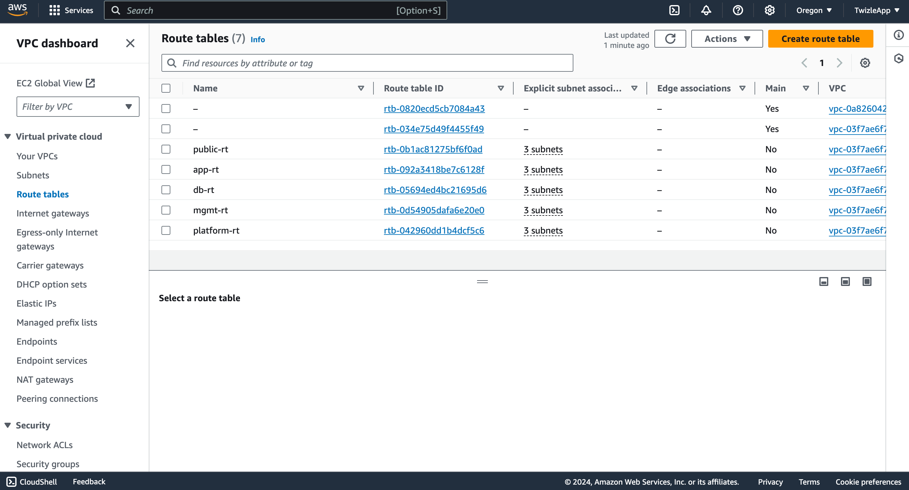
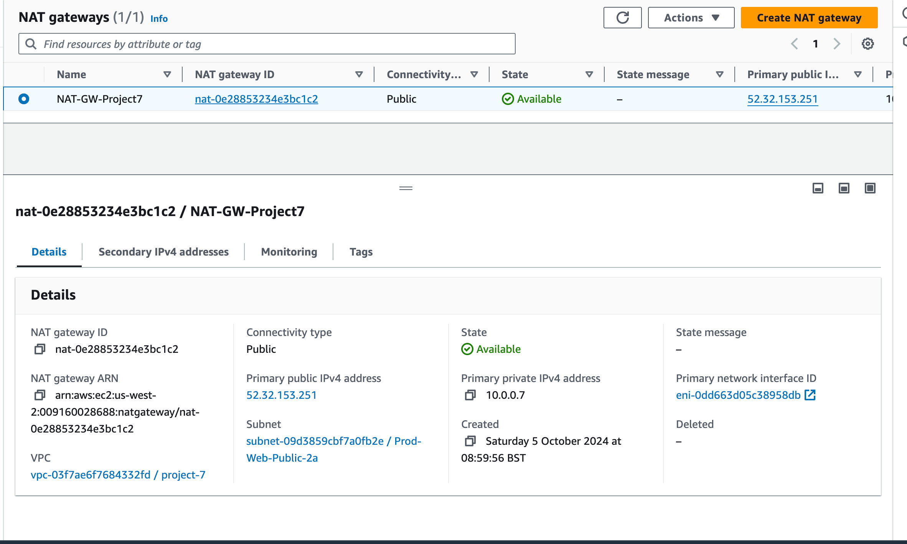
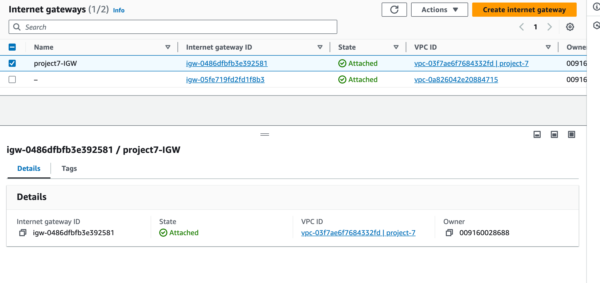
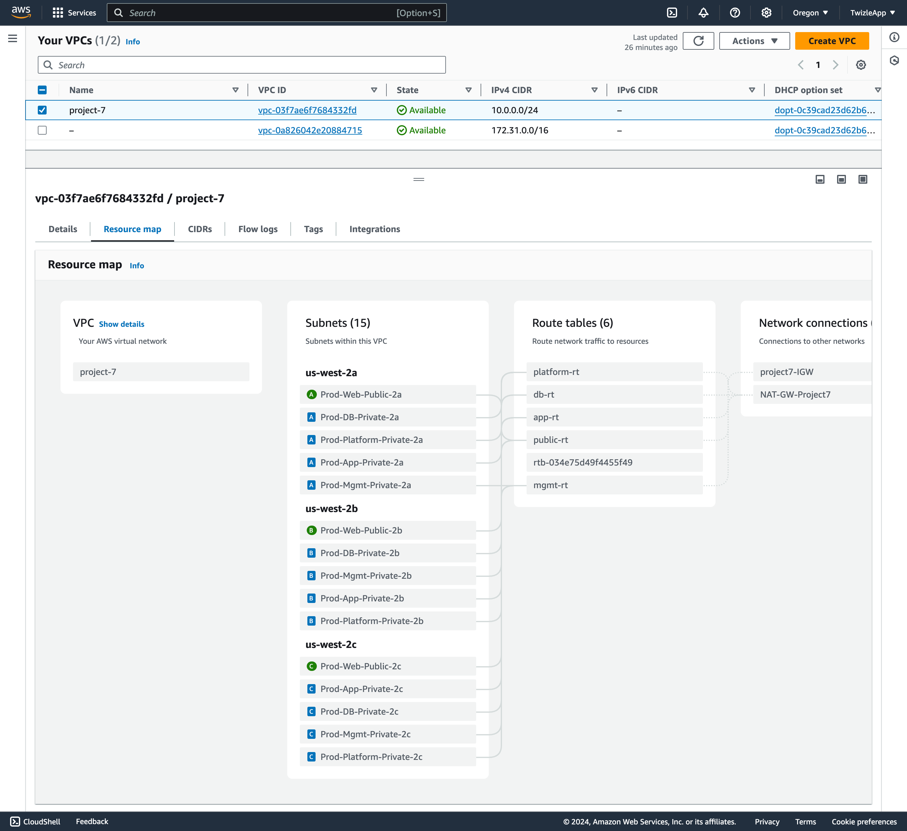

# Project 7: AWS VPC Setup and Configuration

## Introduction

In this project, I focused on designing and deploying a **Virtual Private Cloud (VPC)** in **AWS** to create an isolated network environment for hosting multiple services. The VPC setup included configuring subnets, route tables, internet gateways, NAT gateways, and network access control lists (NACLs). This project is crucial for understanding how to securely manage networking and traffic routing in a cloud environment, ensuring that applications are correctly isolated while maintaining the necessary access to the internet and other resources.

## Key Concepts

- **VPC (Virtual Private Cloud):** A logically isolated section of AWS where you can launch AWS resources in a virtual network that you define.
- **Subnets:** Subdivisions within a VPC that can be public or private, depending on their routing to the internet.
- **Route Tables:** Used to control where network traffic is directed.
- **Internet Gateway (IGW):** A gateway that allows communication between instances in your VPC and the internet.
- **NAT Gateway:** Enables instances in a private subnet to connect to the internet without exposing themselves to incoming traffic.
- **Network ACLs:** Provide an additional layer of security, controlling traffic at the subnet level and traffic filtering.

## Step 1: Understanding the VPC Requirements

Before starting the implementation, it is important to identify the VPC requirements based on the needs of the project:

- **CIDR Block:** 10.0.0.0/24 (allowing up to 256 private IP addresses).
- **Subnets:** I planned to create 15 subnets across three availability zones (us-west-2a, us-west-2b, and us-west-2c) to accommodate different services (e.g., web, application, database).
- **Internet Access:** Public subnets will have direct access to the internet via an Internet Gateway, while private subnets will access the internet through a NAT Gateway for outbound traffic.
- **Security:** Use of Network ACLs to control traffic flow between subnets, particularly restricting access to the database subnets.

- **Task:** Gather and document the VPC requirements.
- **Result:** Requirements documented, ensuring a clear understanding of the VPC design and scope.

## Step 2: VPC and Internet Gateway Creation

### Creating the VPC

I created a VPC with the CIDR block **10.0.0.0/24** using the AWS Management Console.

1. **Go to the AWS VPC service** and create a new VPC with the following details:
    - **VPC Name:** project-7 (PROD-VPC)
    - **CIDR Block:** 10.0.0.0/24
    - **Tenancy:** Default (shared hardware)

### Attaching an Internet Gateway

An Internet Gateway (IGW) was then attached to the VPC to allow public subnets to access the internet.

- **Task:** Create and configure the VPC and attach an Internet Gateway.
- **Result:** VPC and Internet Gateway created and attached successfully.

## Step 3: Creating Subnets

I created both public and private subnets across three availability zones (us-west-2a, us-west-2b, and us-west-2c). Each subnet was assigned a unique CIDR block and availability zone.

### Public Subnets

| Subnet Name         | Availability Zone | CIDR Block    | Type   |
|---------------------|-------------------|---------------|--------|
| Prod-Web-Public-2a  | us-west-2a        | 10.0.0.0/28   | Public |
| Prod-Web-Public-2b  | us-west-2b        | 10.0.0.16/28  | Public |
| Prod-Web-Public-2c  | us-west-2c        | 10.0.0.32/28  | Public |

### Private Subnets

For each service group, I created private subnets. Here's an example for application and database subnets:

#### Application Subnets

| Subnet Name         | Availability Zone | CIDR Block    | Type    |
|---------------------|-------------------|---------------|---------|
| Prod-App-Private-2a | us-west-2a        | 10.0.0.48/28  | Private |
| Prod-App-Private-2b | us-west-2b        | 10.0.0.64/28  | Private |
| Prod-App-Private-2c | us-west-2c        | 10.0.0.80/28  | Private |

#### Database Subnets

| Subnet Name         | Availability Zone | CIDR Block    | Type    |
|---------------------|-------------------|---------------|---------|
| Prod-DB-Private-2a  | us-west-2a        | 10.0.0.96/28  | Private |
| Prod-DB-Private-2b  | us-west-2b        | 10.0.0.112/28 | Private |
| Prod-DB-Private-2c  | us-west-2c        | 10.0.0.128/28 | Private |

- **Task:** Create public and private subnets.
- **Result:** Subnets created and CIDR blocks correctly assigned.

## Step 4: Configuring Route Tables

I configured separate route tables for public and private subnets to control traffic routing:

### Public Route Table

The public subnets were associated with a route table that routes all traffic (0.0.0.0/0) through the Internet Gateway.

### Private Route Tables

The private subnets (application, database, management, and platform) were associated with separate route tables, which route outbound traffic through the NAT Gateway.

- **Task:** Create and configure route tables for public and private subnets.
- **Result:** Route tables created and associated with the correct subnets.

## Step 5: NAT Gateway Setup

A NAT Gateway was created in one of the public subnets to allow instances in the private subnets to access the internet for outbound traffic (e.g., software updates) while keeping them isolated from direct inbound internet access.

- **Task:** Create a NAT Gateway and configure it in the route tables for private subnets.
- **Result:** NAT Gateway created and attached to private subnets.

## Step 6: Internet Gateway for Public Subnets

For the public subnets, I attached the previously created Internet Gateway to the public route table. This allows instances in the public subnet to receive inbound traffic from the internet.

- **Task:** Attach Internet Gateway to the public route table.
- **Result:** Public subnets now have internet access.

## Step 7: Network ACLs Configuration

To enhance security, I configured **Network Access Control Lists (NACLs)** for the database subnets. These NACLs ensure that only the application and management subnets can connect to the database, while traffic from the public subnet is denied.

### Inbound Rules for DB Subnet

| Rule Number | Type       | Protocol | Port Range | Source IP   | Allow/Deny |
|-------------|------------|----------|------------|-------------|------------|
| 100         | Custom TCP | TCP      | 3306       | 10.0.0.48/28 | Allow     |
| 110         | Custom TCP | TCP      | 3306       | 10.0.0.64/28 | Allow     |
| *           | All Traffic| All      | All        | 0.0.0.0/0   | Deny      |

### Outbound Rules for DB Subnet

| Rule Number | Type       | Protocol | Port Range | Destination IP | Allow/Deny |
|-------------|------------|----------|------------|----------------|------------|
| 100         | Custom TCP | TCP      | 3306       | 10.0.0.192/28  | Allow      |
| 110         | Custom TCP | TCP      | 3306       | 10.0.0.224/28  | Allow      |
| *           | All Traffic| All      | All        | 0.0.0.0/0      | Deny       |

- **Task:** Configure NACLs to control traffic between subnets.
- **Result:** NACLs created to restrict database access only to application and management subnets.

## Step 8: Testing and Verifying the VPC Topology

I used the AWS console to verify that all components (subnets, route tables, gateways, and NACLs) were functioning as expected. Additionally, I verified the VPC topology diagram to ensure it matched the design.

- **Task:** Verify the VPC setup and test the connectivity of subnets.
- **Result:** VPC setup successfully verified.

## Clean-Up

After completing the project, I cleaned up the resources by deleting the following:
- Elastic IP
- NAT Gateway
- Route tables and subnets

- **Task:** Clean up AWS resources to avoid unnecessary charges.
- **Result:** Resources cleaned up and project completed successfully.

---

This project provided hands-on experience in designing and configuring a secure VPC in AWS, including subnets, route tables, internet gateways, and NACLs.
