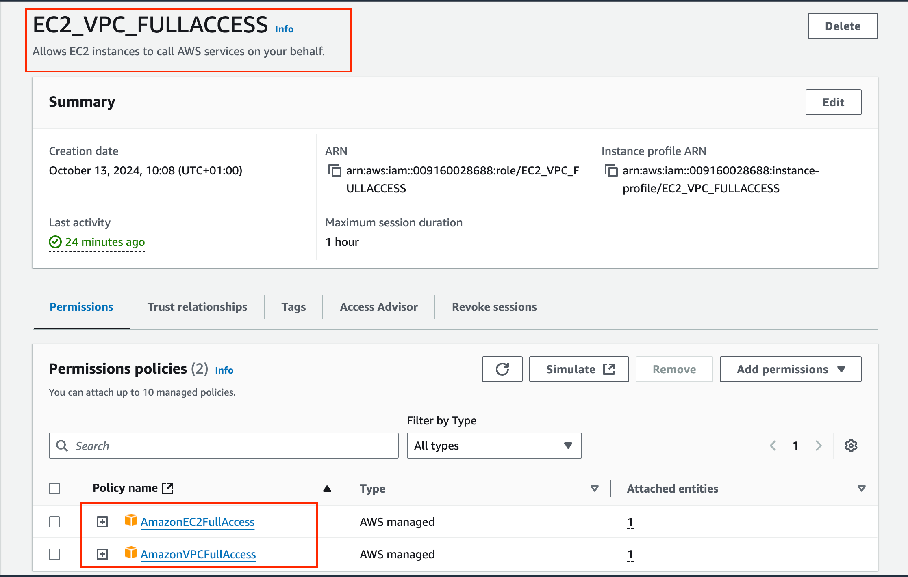
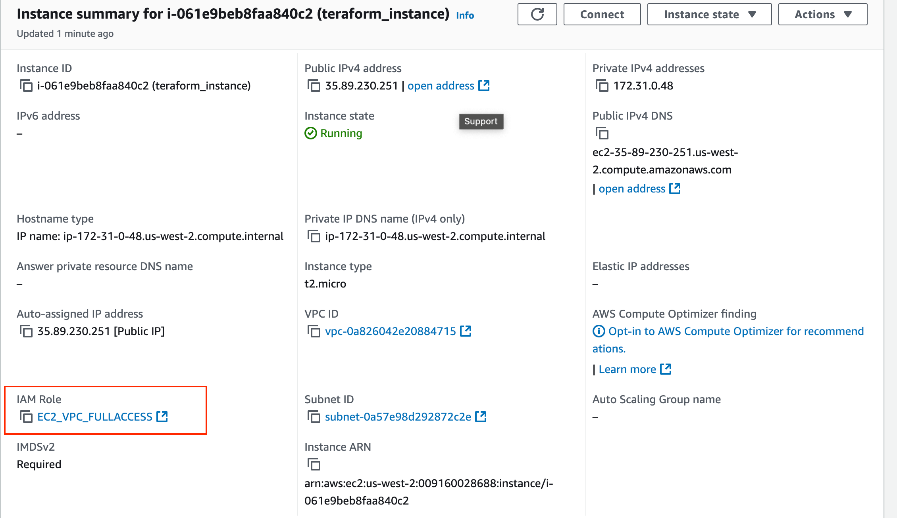
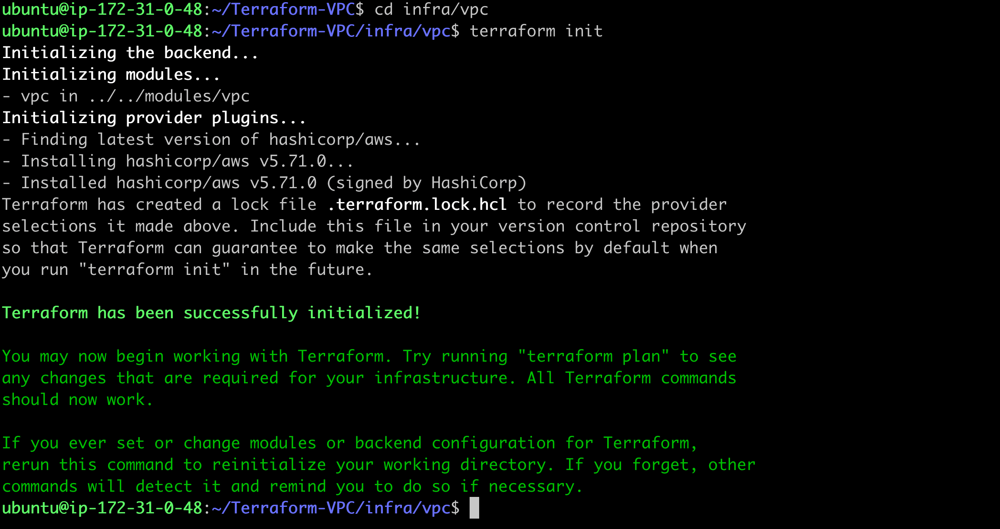
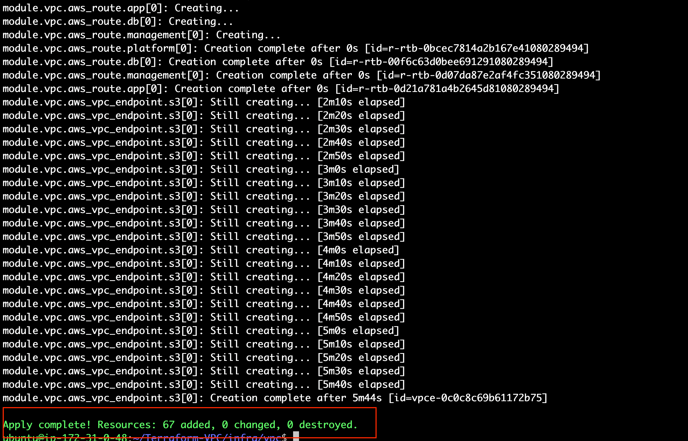

# Project 8: AWS VPC using Terraform

## Introduction

In this project, I automated the creation of an AWS Virtual Private Cloud (VPC) using **Terraform**, a powerful Infrastructure as Code (IaC) tool. Previously, I manually set up a VPC and its associated resources, but managing this process manually can be time-consuming and prone to errors, especially when working with larger infrastructures. By using Terraform, I was able to automate the process, saving time and ensuring consistency across environments.

## Key Concepts

- **Infrastructure as Code (IaC):** IaC allows me to manage and provision infrastructure using machine-readable configuration files. The benefits I gained from this approach include:
  - **Automation:** By automating the setup of infrastructure, I reduced manual intervention, minimized errors, and increased efficiency.
  - **Consistency:** The environments I provisioned were always consistent, reducing discrepancies between different setups.
  - **Version Control:** I tracked infrastructure changes in my repository, allowing me to roll back or review changes over time.
  - **Scalability:** With IaC, I could easily scale the infrastructure by modifying my configuration files.

- **Terraform:** Terraform is an open-source IaC tool that helped me define and manage my infrastructure. I chose Terraform for its:
    - Multi-cloud provider support.
    - Declarative syntax (HCL), allowing me to describe the desired state of the infrastructure.
    - State management, which keeps track of the deployed infrastructure.
    - Modularity, which allowed me to reuse code components efficiently.

## Step 1: Setting Up AWS and EC2

To get started, I needed an EC2 instance with appropriate IAM roles to provision AWS VPC resources using Terraform.

1. **Creating an IAM Role:** First, I created an IAM role with `AmazonVPCFullAccess` and `AmazonEC2FullAccess` permissions.
2. **Launching an EC2 Instance:** I then launched an EC2 instance running **Ubuntu 22.04** and attached the IAM role I created.




3. **Connecting to EC2 via SSH:** Once the instance was running, I connected to it via SSH and installed Terraform using the following command:

```bash
sudo snap install terraform
```

## Step 2: Cloning the Repository

With the environment ready, I cloned the Terraform repository that contains the VPC setup configuration:

```bash
git clone https://github.com/TobiOlajumoke/Terraform-VPC.git
cd Terraform-VPC
```

```text
├── infra
│   └── vpc
│       ├── main.tf
│       └── variables.tf
├── modules
│   └── vpc
│       ├── endpoint.tf
│       ├── internet-gateway.tf
│       ├── nacl.tf
│       ├── nat-gateway.tf
│       ├── outputs.tf
│       ├── route-tables.tf
│       ├── subnet.tf
│       ├── variables.tf
│       └── vpc.tf
└── vars
    └── dev
        └── vpc.tfvars
```

## Step 3: Configuring VPC Variables

Next, Using vim, I updated the owner tag in `vpc.tfvars` to say "Oluseyi". Here’s an example of the configuration I modified:

```bash
#vpc
region               = "us-west-2"
vpc_cidr_block       = "10.0.0.0/16"
instance_tenancy     = "default"
enable_dns_support   = true
enable_dns_hostnames = true

#elastic ip
domain = "vpc"

#nat-gateway
create_nat_gateway = true

#route-table
destination_cidr_block = "0.0.0.0/0"

#tags
owner       = "Oluseyi"
environment = "dev"
cost_center = "DevOps-commerce"
application = "OpsApp"

#subnet

map_public_ip_on_launch       = true

public_subnet_cidr_blocks     = ["10.0.1.0/24", "10.0.2.0/24", "10.0.3.0/24"]
app_subnet_cidr_blocks        = ["10.0.4.0/24", "10.0.5.0/24", "10.0.6.0/24"]
db_subnet_cidr_blocks         = ["10.0.7.0/24", "10.0.8.0/24", "10.0.9.0/24"]
management_subnet_cidr_blocks = ["10.0.10.0/24", "10.0.11.0/24", "10.0.12.0/24"]
platform_subnet_cidr_blocks   = ["10.0.13.0/24", "10.0.14.0/24", "10.0.15.0/24"]
availability_zones            = ["us-west-2a", "us-west-2b", "us-west-2c"]

#public nacl

ingress_public_nacl_rule_no    = [100]
ingress_public_nacl_action     = ["allow"]
ingress_public_nacl_from_port  = [0]
ingress_public_nacl_to_port    = [0]
ingress_public_nacl_protocol   = ["-1"]
ingress_public_nacl_cidr_block = ["0.0.0.0/0"]

egress_public_nacl_rule_no    = [200]
egress_public_nacl_action     = ["allow"]
egress_public_nacl_from_port  = [0]
egress_public_nacl_to_port    = [0]
egress_public_nacl_protocol   = ["-1"]
egress_public_nacl_cidr_block = ["0.0.0.0/0"]

#app nacl

ingress_app_nacl_rule_no    = [100]
ingress_app_nacl_action     = ["allow"]
ingress_app_nacl_from_port  = [0]
ingress_app_nacl_to_port    = [0]
ingress_app_nacl_protocol   = ["-1"]
ingress_app_nacl_cidr_block = ["0.0.0.0/0"]

egress_app_nacl_rule_no    = [200]
egress_app_nacl_action     = ["allow"]
egress_app_nacl_from_port  = [0]
egress_app_nacl_to_port    = [0]
egress_app_nacl_protocol   = ["-1"]
egress_app_nacl_cidr_block = ["0.0.0.0/0"]

##db nacl

ingress_db_nacl_rule_no    = [100]
ingress_db_nacl_action     = ["allow"]
ingress_db_nacl_from_port  = [0]
ingress_db_nacl_to_port    = [0]
ingress_db_nacl_protocol   = ["-1"]
ingress_db_nacl_cidr_block = ["0.0.0.0/0"]

egress_db_nacl_rule_no    = [200]
egress_db_nacl_action     = ["allow"]
egress_db_nacl_from_port  = [0]
egress_db_nacl_to_port    = [0]
egress_db_nacl_protocol   = ["-1"]
egress_db_nacl_cidr_block = ["0.0.0.0/0"]

##management nacl

ingress_management_nacl_rule_no    = [100]
ingress_management_nacl_action     = ["allow"]
ingress_management_nacl_from_port  = [0]
ingress_management_nacl_to_port    = [0]
ingress_management_nacl_protocol   = ["-1"]
ingress_management_nacl_cidr_block = ["0.0.0.0/0"]

egress_management_nacl_rule_no    = [200]
egress_management_nacl_action     = ["allow"]
egress_management_nacl_from_port  = [0]
egress_management_nacl_to_port    = [0]
egress_management_nacl_protocol   = ["-1"]
egress_management_nacl_cidr_block = ["0.0.0.0/0"]

#platform nacl

ingress_platform_nacl_rule_no    = [100]
ingress_platform_nacl_action     = ["allow"]
ingress_platform_nacl_from_port  = [0]
ingress_platform_nacl_to_port    = [0]
ingress_platform_nacl_protocol   = ["-1"]
ingress_platform_nacl_cidr_block = ["0.0.0.0/0"]

egress_platform_nacl_rule_no    = [200]
egress_platform_nacl_action     = ["allow"]
egress_platform_nacl_from_port  = [0]
egress_platform_nacl_to_port    = [0]
egress_platform_nacl_protocol   = ["-1"]
egress_platform_nacl_cidr_block = ["0.0.0.0/0"]

#endpoint

create_s3_endpoint              = true
create_secrets_manager_endpoint = true
create_cloudwatch_logs_endpoint = true

```
## Step 4: Initializing and Planning the Terraform Deployment
Once I configured the variables, I navigated to the infra/vpc directory and initialized Terraform:

```bash
cd infra/vpc
terraform init
```



This command initialized the project, downloaded necessary plugins, and prepared the Terraform environment for deployment.

After initialization, I ran `terraform plan` to check the infrastructure that Terraform would create:

```bash
terraform plan -var-file=../../vars/dev/vpc.tfvars
```

The output from this command gave me a detailed view of the resources Terraform planned to create, such as the VPC, subnets, and gateways.

## Step 5: Applying the Terraform Configuration
I then applied the configuration to provision the VPC and associated resources:

```bash
terraform apply -var-file=../../vars/dev/vpc.tfvars
```
Terraform presented a summary of the changes, and I confirmed by typing `yes`. This step created the VPC, subnets, route tables, NAT gateway, and Internet gateway based on my configuration.



### Step 6: Validate the VPC in AWS Console
Once Terraform completed the deployment, I validated the resources in the AWS Console by checking the Resource Map. This allowed me to visually confirm that all the resources—VPC, subnets, route tables, Internet Gateway, and NAT Gateway—were successfully created.

The VPC resource map included:

- 15 subnets
- 6 route tables
- Internet Gateway
- NAT Gateway
  


### Step 7: Cleaning Up Resources
To avoid unnecessary charges, I cleaned up the resources using the terraform destroy command:

```bash
terraform destroy -var-file=../../vars/dev/vpc.tfvars
```

I confirmed the action, and Terraform proceeded to delete all the resources it had created.

Finally, I terminated the EC2 instance used for running the Terraform scripts.

## Conclusion

This project demonstrated the power of Infrastructure as Code (IaC) using Terraform. By automating the creation of a VPC, I was able to ensure consistency across environments and reduce the time spent on manual provisioning. This approach allowed me to create, validate, and destroy resources efficiently, showcasing the benefits of automation in modern cloud environments.

