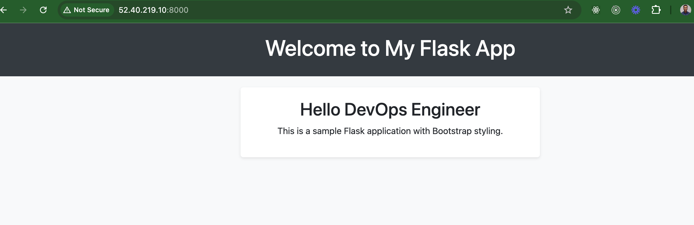
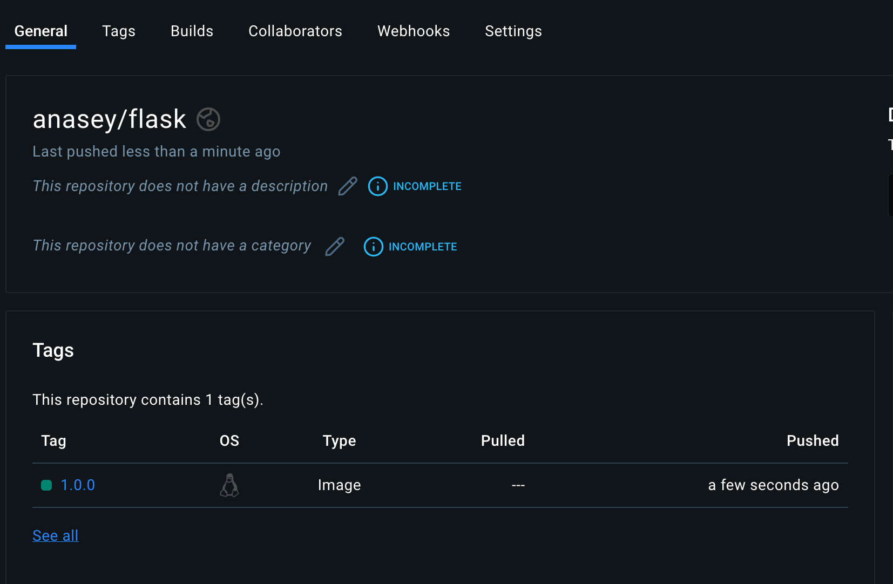

# Project 9: Dockerizing a Flask App and Pushing to Docker Hub

In this project, I learned how to containerize a Python Flask application using Docker, and I deployed it to an AWS EC2 instance. Finally, I pushed the Docker image to Docker Hub for easy access and collaboration. Here's how I did it step by step.

---

### The Story of Life Before Docker

Before Docker, deploying applications was cumbersome and often frustrating. Developers like me faced challenges when transitioning from development to production environments due to inconsistent configurations. Let me share an example scenario:

#### **The Developer's Struggle:**
Shade, a developer, finished writing a Python web application. It worked perfectly on her machine, but as soon as she handed it off to the operations team to deploy on the production server, the problems began to arise.

- **Dependency Hell:** The production environment didn't match her local setup. After hours of debugging, the team finally matched Shade's environment, but at the cost of valuable time.
- **Environment Inconsistency:** Shade’s app behaved differently on her Mac compared to the Linux servers in production.
- **Scalability Issues:** When the app grew, each server had to be configured carefully, which was error-prone and costly.

Virtual machines (VMs) solved some of these problems but introduced new issues—such as being heavyweight and slow. We needed something faster and more efficient. That's when **Docker** entered the scene.

---

### What is Docker?

Docker is a containerization platform that allows us to package our application along with its dependencies into lightweight, portable containers. Here's how Docker simplifies things:

- **Lightweight:** Containers share the host OS kernel, making them smaller and faster than VMs.
- **Consistency:** The environment inside a container is identical across development, testing, and production environments.
- **Portability:** Containers run on any platform that supports Docker.

---

### How Docker Works

Docker uses a **client-server** architecture, consisting of:

- **Docker Client:** The CLI tool I use to interact with Docker.
- **Docker Daemon:** The background service that manages Docker containers, images, networks, and volumes.
- **Docker Images:** A read-only blueprint for creating containers.
- **Docker Containers:** The running instances of Docker images.

---

## Step 1: Provision an EC2 Instance

To begin, I provisioned an Ubuntu 24.04 t2.micro instance on AWS, which served as the environment for this project.

- I SSH'd into the instance to start working.

---

## Step 2: Install and Start Docker

1. First, I updated my package index and, I installed Docker:
```bash
   sudo apt update && sudo apt install docker.io -y
```

2. I started Docker and enabled it to run on boot:
```bash
sudo systemctl start docker && sudo systemctl enable docker
```

3. I checked Docker’s status to ensure it was running:
```bash
sudo systemctl status docker
```

## Step 3: Clone the Docker Project
Next, I cloned the project repository containing the Python Flask app:

1. I installed Git:
```bash
sudo apt install git -y 
```

2. Then I cloned the project repository:
```bash
git clone https://github.com/TobiOlajumoke/docker-flask && cd docker-flask
```

## Step 4: Understand the Dockerfile
I explored the `Dockerfile` to understand how it was structured and how it would containerize my Flask app.

The Dockerfile set up a lightweight Python environment, installed dependencies, created a non-root user for security, and ran the Flask app using Gunicorn.

## Step 5: Build and Run the Docker Container

1. I built the Docker image from the Dockerfile:
```bash
docker build -t flask-application:1.0.0 .
```

2. I verified that the image was built successfully:
```bash
sudo docker images
```

3. I ran the Docker container:
```bash
docker run -d -p 8000:8000 flask-application:1.0.0
```

4. After running the container, I checked its status:
```bash
sudo docker ps
```

## Step 6: Test the Application in Browser
I accessed the Flask app by navigating to the EC2 instance's public IP at port 8000 in my browser:

```bash
http://52.40.219.10:8000
```
Initially, the page didn’t load because I hadn’t yet added port 8000 to the security group. I fixed this by modifying the EC2 security group to allow traffic on port 8000, and the Flask app loaded successfully.



## Step 7: Push the Image to Docker Hub
After successfully containerizing and running the app locally, I wanted to share the image via Docker Hub.

1. First, I logged in to Docker Hub:
```bash 
sudo docker login
```

2. Then, I tagged my image for Docker Hub:
```bash
sudo docker tag flask-application:1.0.0 anasey/flask:1.0.0 
```

3. Finally, I pushed the image to Docker Hub:
```bash
docker push anasey/flask:1.0.0 
```

4. I verified the image was successfully pushed by checking my Docker Hub repository.

5. 

## Conclusion
In this project, I learned how to containerize a Python Flask application using Docker, run it on an AWS EC2 instance, and push the Docker image to Docker Hub. Docker has proven to be a powerful tool that simplifies deployment, ensures consistency across environments, and enables scalability in cloud environments.

